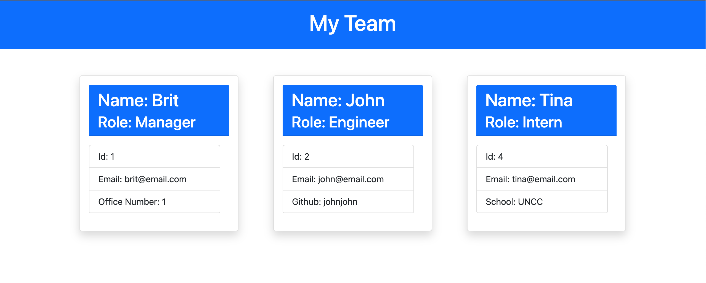

# psychotic-structure
# Object-Oriented Programming Challenge: Team Profile Generator

## Description
This application allows managers to create custom profiles for their employees using their basic information. Managers can run node to enter their team members data directly from their terminal. Technologies used: javascript, node, inquirer, jest. 

## User Story
AS A manager
I WANT to generate a webpage that displays my team's basic info
SO THAT I have quick access to their emails and GitHub profiles

## Acceptance Criteria 
GIVEN a command-line application that accepts user input
WHEN I am prompted for my team members and their information
THEN an HTML file is generated that displays a nicely formatted team roster based on user input
WHEN I click on an email address in the HTML
THEN my default email program opens and populates the TO field of the email with the address
WHEN I click on the GitHub username
THEN that GitHub profile opens in a new tab
WHEN I start the application
THEN I am prompted to enter the team manager’s name, employee ID, email address, and office number
WHEN I enter the team manager’s name, employee ID, email address, and office number
THEN I am presented with a menu with the option to add an engineer or an intern or to finish building my team
WHEN I select the engineer option
THEN I am prompted to enter the engineer’s name, ID, email, and GitHub username, and I am taken back to the menu
WHEN I select the intern option
THEN I am prompted to enter the intern’s name, ID, email, and school, and I am taken back to the menu
WHEN I decide to finish building my team
THEN I exit the application, and the HTML is generated

### ToDO:
-   Edit HTML styling (DONE)
-   Run employee test files (DONE)
-   Move node_modules into .gitignore (DONE)

## Screenshot & Video

https://user-images.githubusercontent.com/97000955/171752834-77f5803a-58a6-4885-b449-f9608258085f.mp4

